<div align="center">

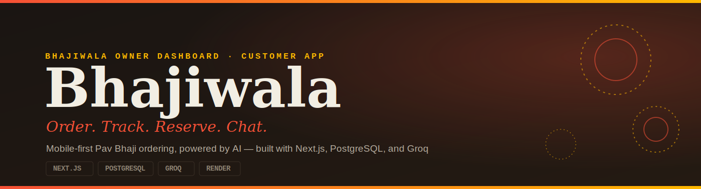

<br/>

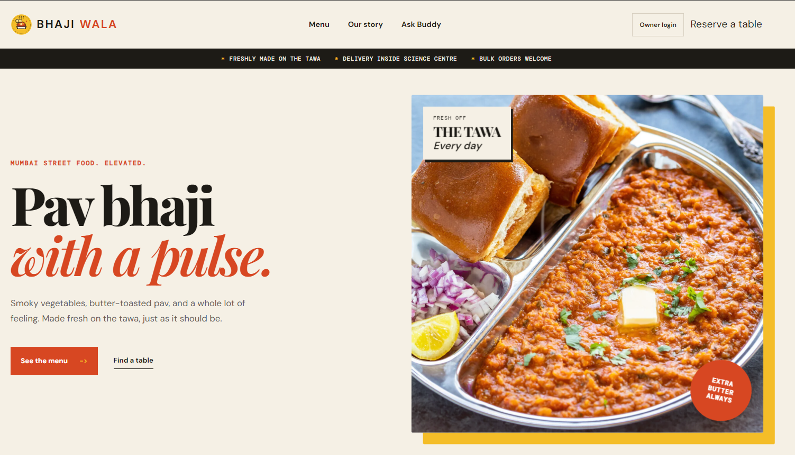

<br/><br/>

[](https://nextjs.org/)
[](https://www.typescriptlang.org/)
[](https://www.postgresql.org/)
[](https://groq.com/)
[](https://bhajiwala.onrender.com)


> 💼 **Demo of a recent freelance project** — designed and built end-to-end for a real food ordering client, from ordering flow to deployment.

> ℹ️ The business name, address, menu, and other details shown inside the app are fictional/demo data used to showcase the project — not real client information.

### 🔗 [Live App → bhajiwala.onrender.com](https://bhajiwala.onrender.com)

[Features](#-what-is-included) • [Architecture](#-architecture) • [Tech Stack](#-tech-stack) • [Setup](#-run-locally) • [Deploy](#-deploy-to-render) • [API](#-api-overview)

</div>

---

## 📖 Overview

Bhajiwala is a full-stack, production-ready food ordering app. Customers browse the menu, place cash-on-delivery orders, reserve tables, track order status in real time, and chat with **Bhaji Buddy** — a bilingual AI assistant. The owner runs the entire operation from a single password-protected dashboard, with optional email alerts landing straight in the kitchen inbox.

> Built to solve a real problem for a real small business — not a demo app.

---

## 📸 Preview

<div align="center">

<table>
  <tr>
    <td align="center" width="50%">
      <b>Owner Dashboard — Reservations</b><br/><br/>
      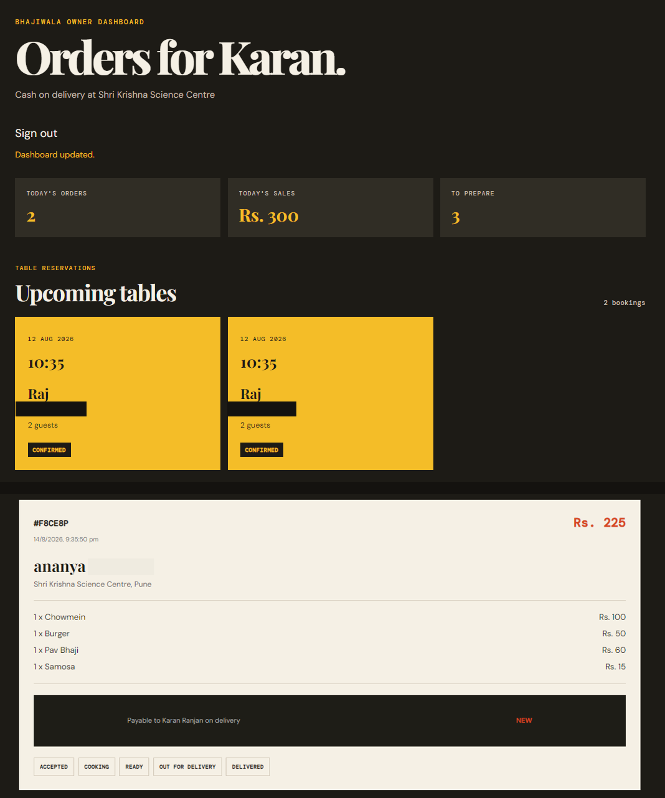
    </td>
    <td align="center" width="50%">
      <b>Owner Dashboard — Live Orders</b><br/><br/>
      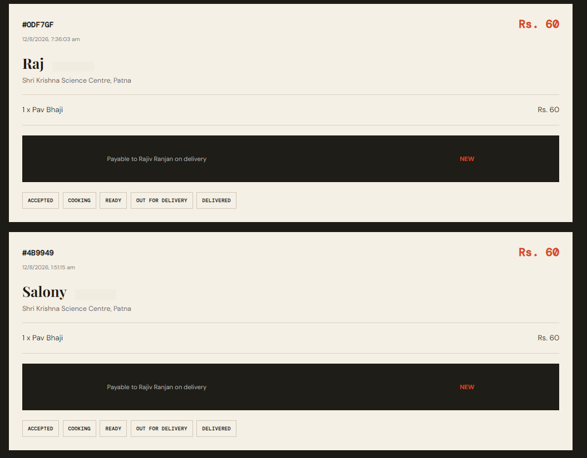
    </td>
  </tr>
  <tr>
    <td align="center" width="50%">
      <b>Bhaji Buddy Chat</b><br/><br/>
      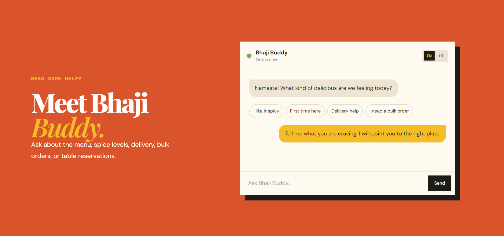
    </td>
    <td align="center" width="50%">
      <b>Order Tracker</b><br/><br/>
      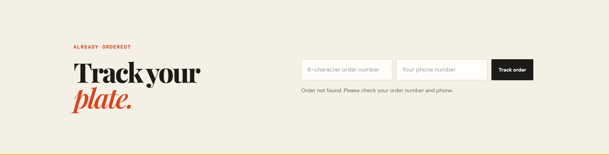
    </td>
  </tr>
  <tr>
    <td align="center" width="50%">
      <b>Table Reservation</b><br/><br/>
      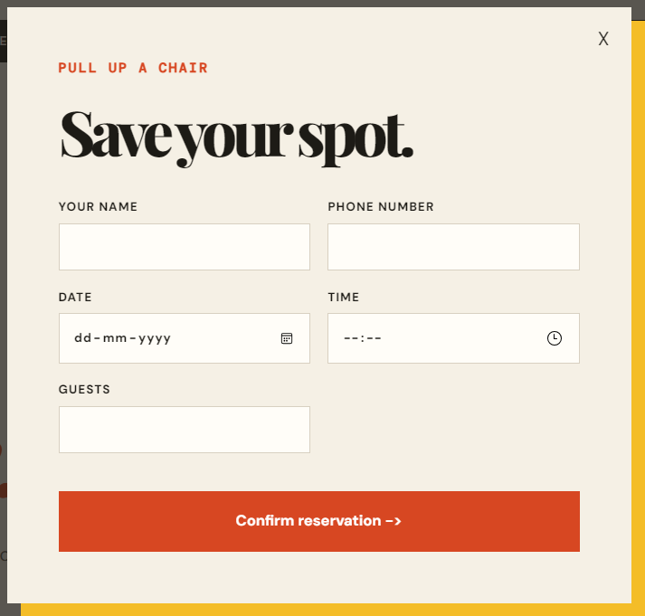
    </td>
    <td align="center" width="50%">
      <b>Printable Bill</b><br/><br/>
      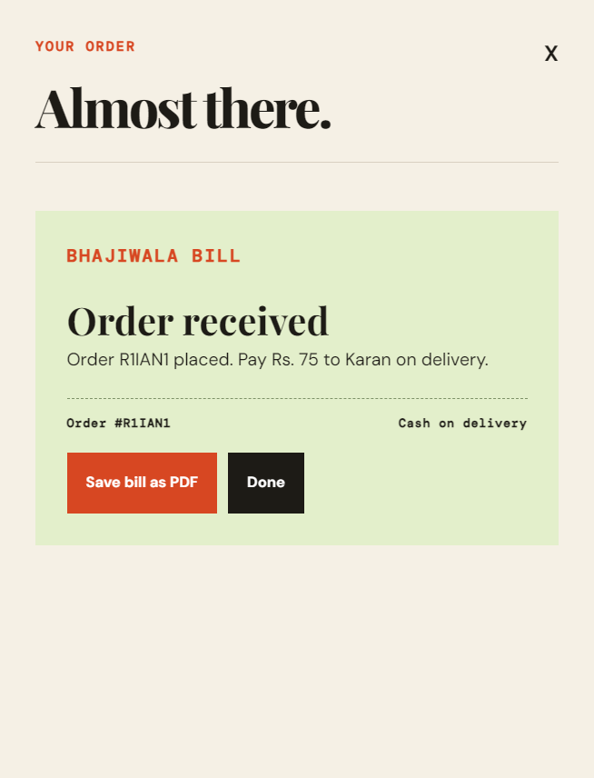
    </td>
  </tr>
</table>

<br/>

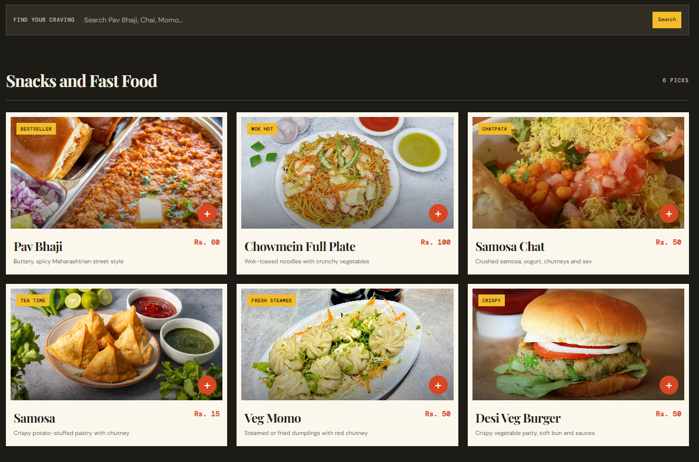

</div>

## ✨ What is included

| | Feature |
|---|---|
| 🛒 | Responsive food menu with search, cart, quantity controls, and cash-on-delivery checkout |
| 💰 | Accurate menu pricing, bulk-order messaging, and delivery inside Science Centre |
| 🧾 | Printable one-page bill / PDF export from the customer order confirmation |
| 📦 | Customer order tracker and one-tap reorder |
| 🪑 | Table reservations visible in the owner dashboard |
| 👨‍🍳 | Owner dashboard for order status: `New → Accepted → Cooking → Ready → Out for delivery → Delivered` |
| 🤖 | English/Hindi **Bhaji Buddy** customer support chat, powered by Groq when configured |
| 📧 | Kitchen email alerts for orders and reservations through Resend (optional) |
| 🗄️ | PostgreSQL persistence with Prisma migrations and automatic menu seeding |
| 🚀 | Render deployment configuration and database-aware health check |
| 🎨 | Branded SVG logo, browser icon, and installable PWA manifest |

---

## 🏗️ Architecture

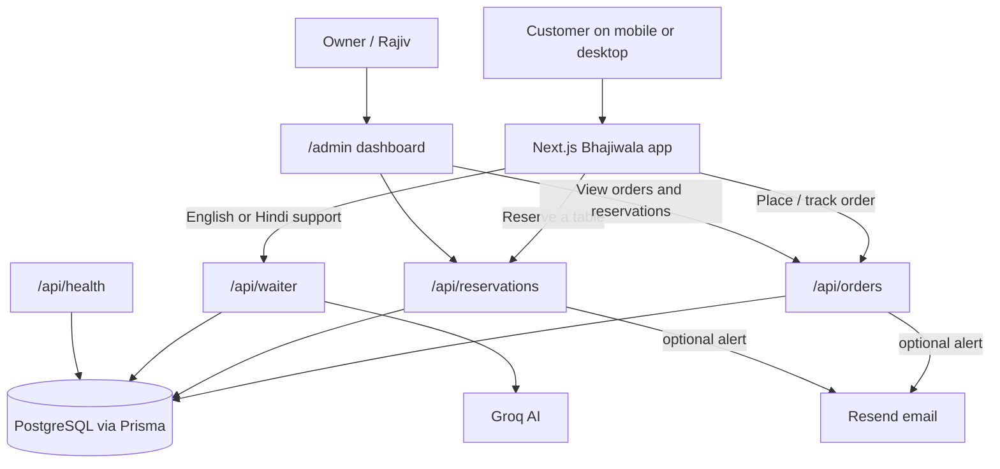

---

## 🧰 Tech stack

| Area | Used technology |
| --- | --- |
| Frontend / server | Next.js 14 App Router, React, TypeScript |
| Styling | Tailwind tooling and custom responsive CSS |
| Database | PostgreSQL + Prisma ORM |
| Validation | Zod |
| AI assistant | Vercel AI SDK + Groq |
| Email alerts | Resend REST API |
| Deployment | Render + Supabase PostgreSQL |

---

## 🗂️ Project map

```text
app/
  page.tsx                 Customer app entry point
  admin/page.tsx           Owner dashboard
  api/orders/              Create, track, and update orders
  api/reservations/        Create and list reservations
  api/waiter/              Bhaji Buddy bilingual support
  api/recommendations/     AI menu recommendations
  api/health/              Render database health check
components/
  adda-experience.tsx      Customer menu, cart, tracker, bill, chat, reservation UI
lib/
  prisma.ts                Shared Prisma client
  menu-context.ts          Database menu context for AI
prisma/
  schema.prisma            PostgreSQL data model
  migrations/              Versioned production schema migrations
  seed.ts                  Idempotent menu seed data
public/logo.svg            Bhajiwala brand mark
render.yaml                Render build, start, and health-check settings
```

---

## ⚙️ Requirements

- Node.js 20 or newer
- npm
- A PostgreSQL database for local development or production (this project uses [Supabase](https://supabase.com/) in production)

---

## 🔐 Environment variables

Copy the example file first:

```bash
cp .env.example .env
```

*(On Windows, use `copy .env.example .env` instead.)*

| Variable | Required | Purpose |
| --- | --- | --- |
| `DATABASE_URL` | ✅ Yes | Pooled PostgreSQL connection string used by Prisma at runtime (e.g. Supabase's PgBouncer connection, port `6543`) |
| `DIRECT_URL` | ✅ Yes | Direct (non-pooled) PostgreSQL connection used by Prisma for migrations (e.g. Supabase, port `5432`) |
| `ADMIN_PASSWORD` | ✅ Yes | Password required to view the owner dashboard data |
| `GROQ_API_KEY` | 🟡 Recommended | Enables Bhaji Buddy and AI recommendations |
| `RESEND_API_KEY` | ⚪ Optional | Enables email notifications |
| `ORDER_NOTIFICATION_EMAIL` | ⚪ Optional | Kitchen notification inbox |
| `ORDER_FROM_EMAIL` | ⚪ Optional | Verified Resend sender, e.g. `Bhajiwala <orders@example.com>` |

Example `.env`:

```dotenv
DATABASE_URL=""
DIRECT_URL=""
GROQ_API_KEY="replace-with-a-new-key"
ADMIN_PASSWORD="change-this-before-deployment"
RESEND_API_KEY=""
ORDER_NOTIFICATION_EMAIL=""
ORDER_FROM_EMAIL="Bhajiwala <orders@your-verified-domain.com>"
```

> ℹ️ When using Supabase, `DATABASE_URL` should point to the **pooled** connection (PgBouncer, port `6543`, with `?pgbouncer=true`) and `DIRECT_URL` should point to the **direct** connection (port `5432`) so `prisma migrate` can run outside the pooler.

### 🐳 Quick local PostgreSQL with Docker (optional)

If Docker Desktop is installed, this starts a local PostgreSQL database without a separate installation:

```bash
docker run --name bhajiwala-postgres -e POSTGRES_USER=postgres -e POSTGRES_PASSWORD=your_password -e POSTGRES_DB=bhajiwala -p 5432:5432 -d postgres:16
```

Use the example `DATABASE_URL` above with the same password.
To stop it later: `docker stop bhajiwala-postgres` — to start it again: `docker start bhajiwala-postgres`.

> ⚠️ Never commit `.env`. It is already ignored by Git.

---

## 🚀 Run locally

```bash
# 1. Install dependencies
npm install

# 2. Create .env and set DATABASE_URL + ADMIN_PASSWORD

# 3. Generate Prisma Client and create database tables
npm run db:generate
npm run db:migrate:dev

# 4. Seed the standard menu inventory
npm run db:seed

# 5. Start the app
npm run dev
```

Open **[http://localhost:3000](http://localhost:3000)** — the customer app lives at `/`, the owner dashboard at `/admin`.

---

## 👨‍🍳 Daily owner workflow

1. Open `/admin` and enter `ADMIN_PASSWORD`
2. Review new orders and reservations
3. Update order status as food moves through preparation and delivery
4. Customers check status live using their order code + phone number
5. If Resend is configured, every order and reservation also arrives by email

> 💵 Orders are paid on delivery — the app does not collect online payments.

---

## 🔌 API overview

| Endpoint | Method | Use |
| --- | --- | --- |
| `/api/orders` | `POST` | Creates a validated customer order and optional email alert |
| `/api/orders` | `GET` | Tracks an order by order suffix + phone number; owner view requires password header |
| `/api/orders` | `PATCH` | Changes an order status; owner password required |
| `/api/reservations` | `POST` | Saves a table reservation and optional email alert |
| `/api/reservations` | `GET` | Lists reservations; owner password required |
| `/api/waiter` | `POST` | Generates Bhaji Buddy support replies |
| `/api/recommendations` | `POST` | Returns menu suggestions for a craving |
| `/api/health` | `GET` | Returns `200` only when PostgreSQL is reachable |

---

## 🚀 Deploy to Render

**Live at: [bhajiwala.onrender.com](https://bhajiwala.onrender.com)**

### 1. Push the project to GitHub

```bash
git init
git add .
git commit -m "Prepare Bhajiwala for Render"
git branch -M main
git remote add origin https://github.com/YOUR_USERNAME/YOUR_REPOSITORY.git
git push -u origin main
```

*(`.env` and `prisma/dev.db` are intentionally ignored — do not add them.)*

### 2. Provision the database

This project uses **[Supabase](https://supabase.com/)** for managed PostgreSQL:

1. Create a new Supabase project
2. From **Project Settings → Database**, copy the **connection pooling** string (port `6543`) for `DATABASE_URL` and the **direct** connection string (port `5432`) for `DIRECT_URL`

### 3. Create the Render web service

1. In Render, click **New** → **Web Service** and connect this GitHub repository
2. Set the runtime to **Node**
3. **Build Command:**
   ```bash
   npm install && npm run build
   ```
4. **Start Command:**
   ```bash
   npm run start
   ```
5. **Health Check Path:** `/api/health`

### 4. Add environment variables

Under the web service's **Environment** tab, add:

```dotenv
DATABASE_URL=""
DIRECT_URL=""
GROQ_API_KEY="your-groq-api-key"
ADMIN_PASSWORD="use-a-long-unique-owner-password"
RESEND_API_KEY=""
ORDER_NOTIFICATION_EMAIL=""
ORDER_FROM_EMAIL="Bhajiwala <orders@your-verified-domain.com>"
```

`RESEND_API_KEY`, `ORDER_NOTIFICATION_EMAIL`, and `ORDER_FROM_EMAIL` are optional — leave them blank to skip email alerts.

### 5. Deploy

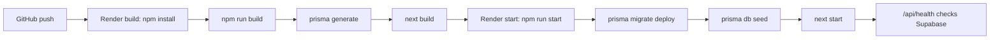

`prisma db seed` uses upserts, so every restart safely refreshes the menu without creating duplicates. Render auto-deploys on every push to `main`; add a custom domain from the Render service settings if desired.

---

## 🗃️ Database commands

| Command | When to use it |
| --- | --- |
| `npm run db:generate` | After changing `schema.prisma` |
| `npm run db:migrate:dev` | Create and apply a new migration locally |
| `npm run db:migrate:deploy` | Apply committed migrations in production |
| `npm run db:seed` | Add or refresh the menu inventory |
| `npm run check` | Verify TypeScript before committing or deploying |
| `npm run build` | Run a production build locally |
| `npm run start` | Run migrations, seed data, then serve production build |

### ⚠️ Important migration note

The old local `prisma/dev.db` SQLite database is **not** migrated automatically to PostgreSQL. Render/Supabase starts with the seeded menu. If you need to preserve old local orders or reservations, export them before switching and import into PostgreSQL deliberately.

---

## 🛠️ Troubleshooting

| Problem | What to check |
| --- | --- |
| Render health check fails | Confirm `DATABASE_URL` / `DIRECT_URL` are set correctly and the Supabase project is active |
| Owner dashboard rejects password | Set `ADMIN_PASSWORD` in the Render Environment tab, redeploy, enter that exact password at `/admin` |
| No order emails | Check all three Resend variables and verify the sender domain in Resend — orders still save without email |
| Bhaji Buddy does not answer | Add a valid `GROQ_API_KEY` — core ordering and reservations work without it |
| Prisma cannot connect locally | Start PostgreSQL and confirm database name, port, user, and password |
| PgBouncer / migration conflicts | Make sure `DATABASE_URL` (pooled, port `6543`) is used at runtime and `DIRECT_URL` (port `5432`) is used only for `prisma migrate` |
| Menu is missing after deployment | Confirm the build completed; run `npm run db:seed` from the Render shell if needed |

---

## 🔒 Security notes

- Use a long, unique `ADMIN_PASSWORD` — never a phone number or common word
- Keep API keys only in Render's Environment tab or `.env`, never in source code
- Rotate keys immediately if they are ever shared or exposed publicly
- The owner dashboard validates the password on every protected API request

---
